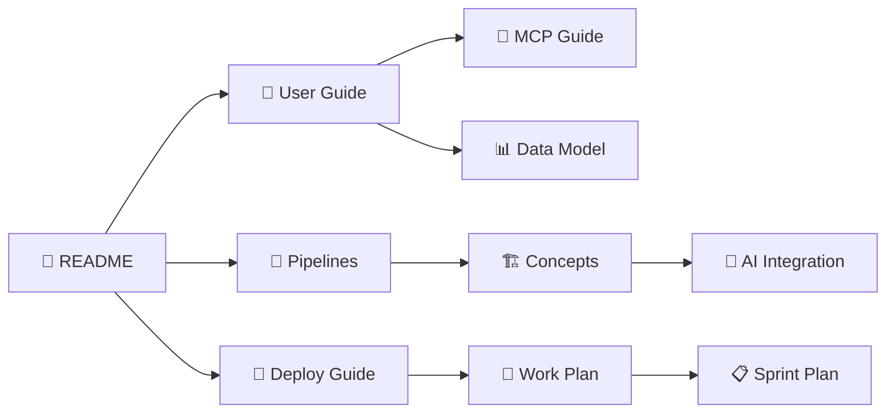

# FOTON System 💡

> **Transforme o Caos de Arquivos em uma Máquina de Gestão.**

O FOTON System organiza, sincroniza e automatiza seu escritório de arquitetura, eliminando o tempo perdido procurando arquivos e gerando documentos.

---

## 📚 Navegação Rápida (Obsidian Vault)

### 🎯 Para Começar

- [[UserGuide|📖 Guia do Usuário]] - Manual completo com "Um Dia na Vida"
- [[deployment_guide|🚀 Guia de Instalação]] - Como instalar e configurar
- [[mcp_guide|🤖 Integração com IA (MCP)]] - Controle por voz/texto

### 🧠 Entendendo o Sistema

- [[Pipelines|🔄 Como a Mágica Acontece]] - Fluxo de dados simplificado
- [[concepts|🏗️ Arquitetura do Sistema]] - Conceitos técnicos (Hexagonal)
- [[DataModel|📊 Modelo de Dados]] - Estrutura de arquivos e DB

### 👨‍💻 Para Desenvolvedores

- [[AI_INTEGRATION_REPORT|🤖 Relatório de IA]] - Como a IA se integra
- [[AGENTIC_SPRINT_PLAN|📋 Planejamento Agentic]] - Sprints e roadmap
- [[workplan|📅 Plano de Trabalho]] - Tarefas e milestones

---

## 🦸 Como o FOTON salva o seu dia

### O Caos

Você é um arquiteto talentoso. Seus projetos são incríveis, mas seu "backoffice" é uma bagunça. Você tem uma planilha Excel para controlar clientes, mas ela nunca bate com as pastas do computador. Você gera contratos copiando e colando do Word, e vira e mexe esquece de mudar o CPF do cliente anterior.

### O Problema

Um dia, você precisa gerar 5 propostas urgentes. Você abre a pasta do cliente "João", mas não acha os dados dele. Abre o Excel, e lá diz que o cliente é "João Silva", mas a pasta está como "J. Silva". Você corrige na mão. Ao gerar o contrato, você percebe que o valor estava errado porque copiou de um modelo antigo. **Frustração total.**

### A Solução

Você instala o FOTON. (Veja [[deployment_guide|como instalar]])

1. **Sincronização Mágica**: Com um clique, o FOTON lê suas pastas e arruma seu Excel. "J. Silva" e "João Silva" viram a mesma pessoa. ([[Pipelines#Sincronização|Como funciona]])
2. **Centros de Verdade**: O FOTON cria um arquivo `INFO-CLIENTE.md` dentro da pasta do João. Agora, os dados moram onde o projeto mora. ([[DataModel|Entenda a estrutura]])
3. **Automação**: Para gerar as 5 propostas, você só digita o valor. O FOTON puxa o nome, endereço e CPF do João automaticamente e gera o PDF. Sem erro de digitação. ([[UserGuide#Geração de Documentos|Veja como]])

### O Retorno a Produtividade

Você gastou 10 minutos no que levaria 2 horas. Seus arquivos estão organizados, seus contratos estão seguros e você tem tempo para o que importa: **Projetar.**

---

## 🚀 O Que o FOTON Faz Por Você?

### 1. Gestão de Clientes e Serviços

> "O Fim do 'Onde Salvei?'"

- **Sincronização Bidirecional**: O que está na pasta vai para o Excel, e vice-versa. ([[Pipelines#Sincronização|Veja o fluxo]])
- **Banco de Dados Distribuído**: Seus dados vivem nas pastas, em arquivos de texto simples (`INFO-*.md`). Leves, seguros e fáceis de editar. ([[DataModel#Centros de Verdade|Saiba mais]])

### 2. Geração de Documentos

> "Adeus, Ctrl+C Ctrl+V"

- **Context-Aware**: O sistema sabe quem é o cliente pela pasta onde você está. ([[concepts#Context-Aware Engine|Entenda a lógica]])
- **Templates Inteligentes**: Use seus modelos de Word e PowerPoint. O sistema preenche as lacunas (`@nome`, `@valor`) para você. ([[UserGuide#Geração de Documentos|Tutorial completo]])

### 3. Integração com IA

> "Seu assistente que nunca esquece nada"

- **Controle por Voz/Texto**: Use Claude ou Cursor para gerenciar o escritório em linguagem natural. ([[mcp_guide|Configure em 2 minutos]])
- **Memória Vetorial (RAG)**: Pergunte "O que sabemos sobre projetos residenciais?" e a IA busca em todos os seus documentos. ([[AI_INTEGRATION_REPORT|Como funciona]])

### 4. Modo Avançado (Ferramentas Administrativas)

> "Para quando você precisa de super poderes"

- **Refatoração de Dados**: Mudou o nome de uma variável? O sistema atualiza todos os seus arquivos de uma vez. ([[UserGuide#Schema Manager|Veja como]])
- **Diagnóstico**: Um "Check-up" completo para garantir que nenhuma pasta está perdida ou sem dono. ([[UserGuide#Diagnóstico|Entenda]])

---

## 🛠️ Instalação Rápida

Veja o [[deployment_guide|Guia de Instalação Completo]] ou siga os passos abaixo:

1. **Pré-requisitos**: Python 3.10+ instalado.
2. **Instalar Dependências**:

    ```bash
    pip install -r requirements.txt
    ```

3. **Rodar**:

    ```bash
    python foton_system/interfaces/cli/main.py
    ```

    Ou use:

    ```bash
    foton --info  # Ver caminhos do sistema
    foton --mcp-config  # Configurar IA
    ```

---

## 🗺️ Mapa de Conceitos



---

## 📖 Leia Também

- [[concepts|Conceitos de Arquitetura]] - Entenda a Arquitetura Hexagonal
- [[Pipelines|Pipelines do Sistema]] - Visualize o fluxo de dados
- [[DataModel|Modelo de Dados]] - Como os dados estão organizados
- [[AI_INTEGRATION_REPORT|IA no FOTON]] - Como a inteligência artificial ajuda
- [[workplan|Plano de Trabalho]] - Roadmap e funcionalidades planejadas

---

**Desenvolvido para Arquitetos que querem projetar, não gerenciar arquivos.**

🔗 [LAMP Arquitetura](https://github.com/LAMP-LUCAS/fotonSystem) | 🌍 [Mundo AEC](https://www.mundoaec.com)
