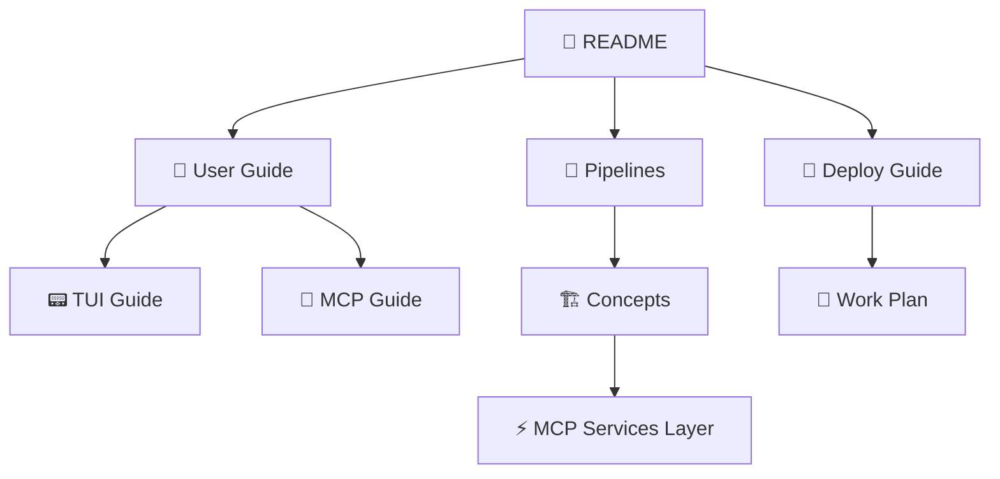

# 💡 FOTON System

> **Transforme o Caos de Arquivos em uma Máquina de Gestão.**

O FOTON System organiza, sincroniza e automatiza seu escritório de arquitetura, eliminando o tempo perdido procurando arquivos e gerando documentos.

## 📚 Documentação (Acesso Rápido)

### 🏛️ Para Agentes de IA
- [[LlmProtocol|📜 Protocolo de Documentação]] - **LEITURA OBRIGATÓRIA PARA AGENTES**
- [[Index|🗺️ Mapa de Conteúdo (MOC)]] - Navegação por domínios
- [[LlmContext|🧠 Contexto Geral para LLMs]] - Identidade do sistema
- [[SystemManifest|📋 Manifesto do Sistema]] - Visão geral técnica

### 🎯 Para o Arquiteto (Usuário)
- [[UserGuide|📖 Guia do Usuário]] - Manual completo
- [[DeploymentUserGuide|💾 Implantação e Backup]] - Guia de segurança de dados
- [[TuiGuide|📟 Guia do Modo Terminal]] - Produtividade turbo
- [[QuickReference|📑 Referência Rápida]] - Comandos e atalhos

---

## 🦸 Como o FOTON salva o seu dia

### O Caos

Você é um arquiteto talentoso. Seus projetos são incríveis, mas seu "backoffice" é uma bagunça. Você tem uma planilha Excel para controlar clientes, mas ela nunca bate com as pastas do computador. Você gera contratos copiando e colando do Word, e vira e mexe esquece de mudar o CPF do cliente anterior.

### O Problema

Um dia, você precisa gerar 5 propostas urgentes. Você abre a pasta do cliente "João", mas não acha os dados dele. Abre o Excel, e lá diz que o cliente é "João Silva", mas a pasta está como "J. Silva". Você corrige na mão. Ao gerar o contrato, você percebe que o valor estava errado porque copiou de um modelo antigo. **Frustração total.**

### A Solução

Você instala o FOTON. (Veja [[DeploymentGuide|como instalar]])

1. **Sincronização Mágica**: Com um clique, o FOTON lê suas pastas e arruma seu Excel. "J. Silva" e "João Silva" viram a mesma pessoa. ([[Pipelines|Como funciona]])
2. **Centros de Verdade**: O FOTON cria um arquivo `INFO-CLIENTE.md` dentro da pasta do João. Agora, os dados moram onde o projeto mora. ([[DataModel|Entenda a estrutura]])
3. **Automação**: Para gerar as 5 propostas, você só digita o valor. O FOTON puxa o nome, endereço e CPF do João automaticamente e gera o PDF. Sem erro de digitação. ([[UserGuide|Veja como]])

### O Retorno a Produtividade

Você gastou 10 minutos no que levaria 2 horas. Seus arquivos estão organizados, seus contratos estão seguros e você tem tempo para o que importa: **Projetar.**

---

## 🚀 O Que o FOTON Faz Por Você?

### 1. Gestão de Clientes e Serviços

> "O Fim do 'Onde Salvei?'"

- **Sincronização Bidirecional**: O que está na pasta vai para o Excel, e vice-versa. ([[Pipelines|Veja o fluxo]])
- **Banco de Dados Distribuído**: Seus dados vivem nas pastas, em arquivos de texto simples (`INFO-*.md`). Leves, seguros e fáceis de editar. ([[DataModel|Saiba mais]])

### 2. Geração de Documentos

> "Adeus, Ctrl+C Ctrl+V"

- **Context-Aware**: O sistema sabe quem é o cliente pela pasta onde você está. ([[Concepts|Entenda a lógica]])       
- **Templates Inteligentes**: Use seus modelos de Word e PowerPoint. O sistema preenche as lacunas (`@nome`, `@valor`) para você. ([[UserGuide|Tutorial completo]])

### 3. Integração com IA

> "Seu assistente que nunca esquece nada"

- **Controle por Voz/Texto**: Use Claude ou Cursor para gerenciar o escritório em linguagem natural. ([[McpGuide|Configure em 2 minutos]])
- **Memória Vetorial (RAG)**: Pergunte "O que sabemos sobre projetos residenciais?" e a IA busca em todos os seus documentos. ([[AiIntegrationReport|Como funciona]])

### 4. Modo Avançado (Ferramentas Administrativas)

> "Para quando você precisa de super poderes"

- **Refatoração de Dados**: Mudou o nome de uma variável? O sistema atualiza todos os seus arquivos de uma vez. ([[UserGuide|Veja como]])
- **Diagnóstico**: Um "Check-up" completo para garantir que nenhuma pasta está perdida ou sem dono. ([[UserGuide|Entenda]])    

---

## 🛠️ Instalação Rápida

### Opção A: Executável (Recomendado)

Baixe o instalador na aba **Releases** do GitHub e rode. Pronto!

### Opção B: Via Python (Devs)

```bash
pip install -r requirements.txt
python -m foton_system.main --tui  # Modo Turbo (Terminal)
python -m foton_system.main --gui  # Modo Visual (Janelas)
```

Use `foton --info` para ver onde seus dados estão salvos.

---

## 🗺️ Mapa de Conceitos


```mermaid
graph TD
    README[📄 README] --> UserGuide[📖 User Guide]
    README --> Pipelines[🔄 Pipelines]
    README --> deployment[🚀 Deploy Guide]

    UserGuide --> TUI[📟 TUI Guide]
    UserGuide --> mcp[🤖 MCP Guide]

    Pipelines --> concepts[🏗️ Concepts]
    concepts --> MCPServices[⚡ MCP Services Layer]

    deployment --> workplan[📅 Work Plan]
```

---

## 📖 Leia Também

- [[Concepts|Conceitos de Arquitetura]] - Entenda a Arquitetura Hexagonal
- [[Pipelines|Pipelines do Sistema]] - Visualize o fluxo de dados
- [[DataModel|Modelo de Dados]] - Como os dados estão organizados
- [[AiIntegrationReport|IA no FOTON]] - Como a inteligência artificial ajuda
- [[WorkPlan|Plano de Trabalho]] - Roadmap e funcionalidades planejadas

---

**Desenvolvido para Arquitetos que querem projetar, não gerenciar arquivos.**

🔗 [LAMP Arquitetura](https://github.com/LAMP-LUCAS/fotonSystem) | 🌍 [Mundo AEC](https://www.mundoaec.com)
