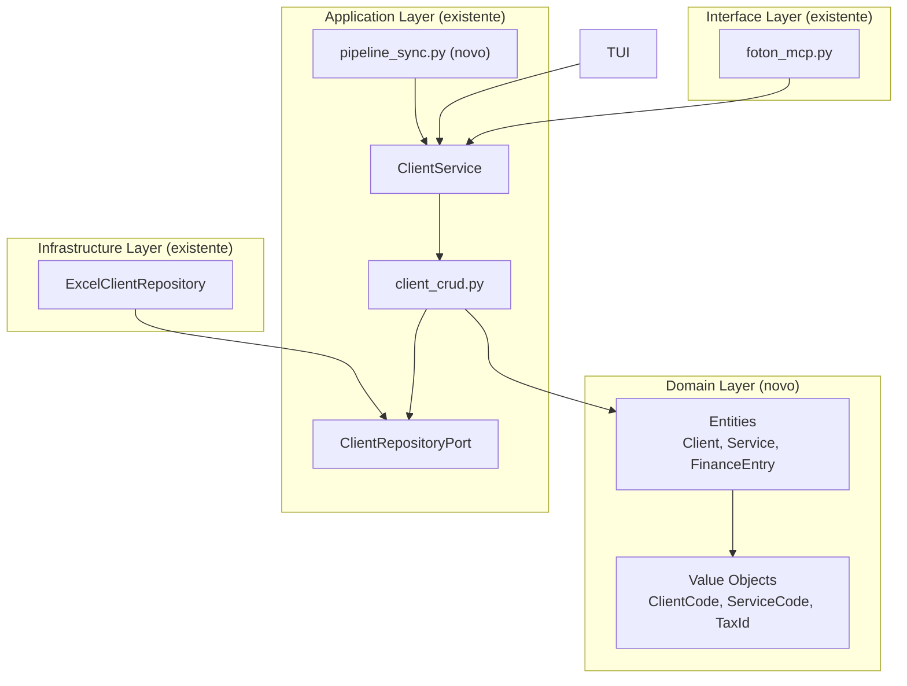
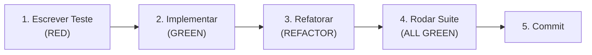

# PRD & Roadmap — Foton System v1.5.0
## Sprint: Domain Model, CRUD & Pipeline Sync

> Product Requirements Document (PRD) com roadmap detalhado de desenvolvimento.
> UI/UX items migrated to EPIC-001 (SPEC-UX-v1.0).

---

## 1. Visão Geral

### 1.1 Objetivo

Elevar o Foton System de uma aplicação baseada em DataFrames cruos para uma arquitetura com **entidades de domínio ricas**, **CRUD completo** (Create/Read/Update/**Delete**) e **sincronização unificada**. UI/UX foi realocado para EPIC-001 (SPEC-UX-v1.0).

### 1.2 Escopo

| Dimensão | Atual (v1.4.0) | Alvo (v1.5.0) |
|----------|-----------------|----------------|
| Domínio | DataFrames cruos | Entidades Client, Service, FinanceEntry |
| CRUD | CR (Create/Read) | CRUD completo + soft delete |
| Sync | 7 tools fragmentadas | Pipeline unificado bidirecional |
| MCP Tools | 38 | 43 (+5) |
| Testes | 410 | ~453 (+43) |

### 1.3 Pré-requisitos

- [x] 410 testes passando, zero regressão
- [x] Excel schema com `baseClientes` + `baseServicos`
- [x] Arquitetura Hexagonal (Ports & Adapters) estável
- [x] `InfoPatternResolver` como precedente de Value Object
- [x] `FakeClientRepository` como fixture de teste

### 1.4 Decisões Arquiteturais

| Decisão | Escolha | Justificativa |
|---------|---------|---------------|
| Delete | **Soft delete** (coluna `Status`) | Reversibilidade, auditoria, sem perda de dados |
| Entidades | **Refatoração gradual** | Não quebrar 410 testes existentes |
| Port | **Não alterar inicialmente** | Evitar quebra do FakeClientRepository (R1) |
| Migração | **Transparente** | Coluna `Status` com fallback `"ATIVO"` |
| Sync | **Dry-run por default** | Proteção contra corrupção de dados (R6) |

---

## 2. Arquitetura Alvo

### 2.1 Estrutura de Diretórios (novos em 🆕)

```
modules/clients/
├── domain/                          🆕  ← Camada de domínio
│   ├── __init__.py
│   ├── models/
│   │   ├── __init__.py
│   │   ├── client.py                🆕  Client entity
│   │   ├── service.py               🆕  Service entity
│   │   └── finance_entry.py         🆕  FinanceEntry entity
│   └── value_objects/
│       ├── __init__.py
│       ├── client_code.py           🆕  ClientCode VO
│       ├── service_code.py          🆕  ServiceCode VO
│       └── tax_id.py                🆕  TaxId VO (NIF/CPF/CNPJ)
├── application/
│   ├── ports/
│   │   └── client_repository_port.py     (extensão posterior)
│   └── use_cases/
│       ├── client_crud.py                (extensão: soft_delete, restore)
│       ├── client_service.py             (extensão: métodos delete/restore)
│       └── ...
└── infrastructure/
    └── repositories/
        └── excel_client_repository.py    (extensão: coluna Status, migração)

modules/sync/                        
└── application/
    └── pipeline_sync.py             🆕  Pipeline unificado

tests/unit/
├── domain/                          🆕
│   ├── test_client_code.py          🆕
│   ├── test_service_code.py         🆕
│   ├── test_tax_id.py               🆕
│   ├── test_client_entity.py        🆕
│   └── test_service_entity.py       🆕
└── ...
```

### 2.2 Diagrama de Dependências



---

## 3. Fases de Implementação

### Fase 1 — Domain Model Foundation

> **Objetivo:** Criar entidades de domínio que encapsulem regras de negócio.
> **Dependências:** Nenhuma
> **Esforço estimado:** 6-8h
> **Testes novos:** ~20

#### 1.1 Value Objects

**Localização:** `modules/clients/domain/value_objects/`

| Arquivo | Classe | Validação | Pattern |
|---------|--------|-----------|---------|
| `client_code.py` | `ClientCode` | `^[A-Z]{3}\d{2}$` | Ex: `JOS01` |
| `service_code.py` | `ServiceCode` | `^[A-Z]{6}\d{2}$` | Ex: `JOSRES01` |
| `tax_id.py` | `TaxId` | 8-14 dígitos limpos | NIF/CPF/CNPJ |

**Padrão:** Seguir `InfoPatternResolver` como referência — `@dataclass(frozen=True)`, `__eq__`, `__hash__`, `__repr__`, `validate()` classmethod.

```python
# Exemplo de assinatura (client_code.py)
@dataclass(frozen=True)
class ClientCode:
    """Value Object para código de cliente (formato: AAA00)."""
    value: str

    def __post_init__(self):
        if not re.match(r'^[A-Z]{3}\d{2}$', self.value):
            raise ValueError(f"Código de cliente inválido: {self.value}")

    @classmethod
    def validate(cls, raw: str) -> bool:
        """Verifica se a string é um código válido sem lançar exceção."""
        return bool(re.match(r'^[A-Z]{3}\d{2}$', raw))
```

#### 1.2 Entidades

**Localização:** `modules/clients/domain/models/`

| Arquivo | Classe | Responsabilidade |
|---------|--------|-----------------|
| `client.py` | `Client` | Encapsula dados + regras de negócio do cliente |
| `service.py` | `Service` | Encapsula dados + regras do serviço |
| `finance_entry.py` | `FinanceEntry` | Encapsula entrada financeira |

**Mapeamento Excel ↔ Entidade:**

```python
# client.py — Mapeamento explícito Excel vs Entity
EXCEL_TO_ENTITY = {
    'NomeCliente': 'nome',
    'Alias': 'alias',
    'CodCliente': 'codigo',      # → ClientCode
    'CPF_CNPJ': 'nif',           # → TaxId  ⚠️ campo nomeado diferente
    'Email': 'email',
    'TelefoneCliente': 'telefone',
    'Status': 'status',
}
```

**Regras de negócio na entidade:**
- `soft_delete()` → muda `status` para `"DELETADO"`
- `restore()` → muda `status` para `"ATIVO"`
- `is_active()` → `status == "ATIVO"`
- `to_row()` → converte para `dict` compatível com DataFrame
- `from_row()` → classmethod que cria entidade a partir de row

#### 1.3 Migração Transparente da Coluna Status

**Em `ExcelClientRepository.get_clients_dataframe()`:**

```python
# Fallback: se coluna Status não existir, assume ATIVO
if 'Status' not in df.columns:
    df['Status'] = 'ATIVO'
```

**Em `_ensure_database_exists()`:** Adicionar `'Status'` e `'CodCliente'` às colunas de criação.

#### 1.4 Testes (TDD — escrever PRIMEIRO)

| Arquivo de Teste | Cenários |
|-----------------|----------|
| `test_client_code.py` | válido, inválido (lowercase, curto, longo), validate() |
| `test_service_code.py` | válido, inválido, validate() |
| `test_tax_id.py` | CPF (11), CNPJ (14), NIF (9), inválido (<8, >14) |
| `test_client_entity.py` | to_row, from_row, soft_delete, restore, is_active |
| `test_service_entity.py` | to_row, from_row, soft_delete |
| `test_repository_status_migration.py` | DataFrame sem coluna Status → fallback ATIVO |

#### 1.5 Definition of Done (DoD)

- [ ] Todos os Value Objects criados com testes passando
- [ ] Entidades Client e Service com to_row/from_row testados
- [ ] Migração transparente da coluna Status implementada
- [ ] `_ensure_database_exists()` atualizado com colunas Status e CodCliente
- [ ] FakeClientRepository atualizado com suporte a coluna Status
- [ ] 410 testes existentes continuam passando (zero regressão)
- [ ] ~20 novos testes passando

---

### Fase 2 — CRUD Completeness

> **Objetivo:** DELETE, UPDATE melhorado, validação de financeiro.
> **Dependências:** Fase 1
> **Esforço estimado:** 8-10h
> **Testes novos:** ~15

#### 2.1 Soft Delete no Domínio

**Em `client_crud.py`:**

```python
def soft_delete_client(alias: str, repository, config) -> dict:
    """Marca cliente como DELETADO. POP-auditado."""
    # 1. Lê DataFrame
    # 2. Valida existência
    # 3. Marca Status = "DELETADO"
    # 4. Salva
    # 5. Auditoria POP
    # 6. Retorna resultado

def restore_client(alias: str, repository, config) -> dict:
    """Restaura cliente deletado. POP-auditado."""
```

> [!IMPORTANT]
> **Não alterar `ClientRepositoryPort`** — implementar via operações compostas (`get_clients_dataframe()` → modificar → `save_clients()`). Isso evita quebrar o FakeClientRepository e os 410 testes existentes.

#### 2.2 Soft Delete no ClientService

```python
# client_service.py — novos métodos delegando para client_crud
def soft_delete_client(self, alias: str) -> dict: ...
def restore_client(self, alias: str) -> dict: ...
def soft_delete_service(self, client_alias: str, service_alias: str) -> dict: ...
```

#### 2.3 MCP Tools de Delete

| Tool | Parâmetros | Descrição |
|------|-----------|-----------|
| `remover_cliente` | `cliente`, `confirmar=False` | Soft delete com dupla confirmação |
| `restaurar_cliente` | `cliente` | Restaura cliente deletado |
| `remover_servico` | `cliente`, `servico`, `confirmar=False` | Soft delete serviço |
| `atualizar_servico` | `cliente`, `servico`, `campo`, `valor` | Update campo específico |

#### 2.4 Validação de Financeiro

Melhorias em `registrar_financeiro`:

| Validação | Regra | Exceção |
|-----------|-------|---------|
| Tipo | `tipo in ["ENTRADA", "SAIDA"]` (case-insensitive) | `ValidationError` |
| Cliente | Verificar existência no DB | `ClientNotFoundError` |
| Duplicata | Mesma descrição + valor + data | Warning (não bloqueia) |
| DataRegistro | Adicionada automaticamente | — |

#### 2.5 Update de INFO Files

Melhorar `update_client_info_file()`:
- Substituição de seção inteira (não só append)
- Remoção de seção
- Atualização de campo via regex `@campo: valor`

#### 2.6 Testes (TDD)

| Arquivo de Teste | Cenários |
|-----------------|----------|
| `test_soft_delete_client.py` | delete ativo, delete inexistente, duplo delete |
| `test_restore_client.py` | restore deletado, restore ativo (no-op) |
| `test_soft_delete_service.py` | delete, inexistente |
| `test_update_service_info.py` | campo válido, campo readonly, inexistente |
| `test_financeiro_validation.py` | tipo válido/inválido, duplicata, cliente inexistente |
| `test_update_info_section.py` | substituição, remoção, campo específico |

#### 2.7 DoD

- [ ] Soft delete/restore de clientes e serviços funcionando
- [ ] 4 novas MCP tools registradas e testadas
- [ ] Validações de financeiro implementadas
- [ ] Update de INFO files melhorado
- [ ] POP Auditado para delete/restore
- [ ] Backup `.bak` antes de soft delete
- [ ] ~15 novos testes passando
- [ ] Zero regressão nos 430+ testes

---

### Fase 3 — Pipeline de Sync

> **Objetivo:** Pipeline consolidado de sincronização.
> **Dependências:** Fase 2 (usa soft delete para relatório)
> **Esforço estimado:** 6-8h
> **Testes novos:** ~8

#### 3.1 Pipeline Unificado

**Localização:** `modules/sync/application/pipeline_sync.py`

```python
def pipeline_sincronizacao(
    client_service: ClientService,
    direcao: str = "bidirecional",
    dry_run: bool = True,          # ⚠️ Default True (segurança)
) -> SyncReport:
    """
    Pipeline unificado de sincronização.

    Passos:
    1. snapshot() — captura estado atual DB + pastas
    2. diff()     — calcula diferenças
    3. validate() — verifica conflitos
    4. apply()    — aplica mudanças (se dry_run=False)
    5. report()   — gera relatório consolidado
    """
```

#### 3.2 SyncReport

```python
@dataclass
class SyncReport:
    """Relatório estruturado de sincronização."""
    direcao: str
    dry_run: bool
    clientes_novos: list[str]
    clientes_atualizados: list[str]
    clientes_deletados: list[str]
    servicos_novos: list[str]
    servicos_atualizados: list[str]
    conflitos: list[dict]           # {tipo, item, descricao}
    erros: list[str]
    duracao_segundos: float
    timestamp: str

    def to_dict(self) -> dict: ...  # Para serialização MCP
    def resumo(self) -> str: ...    # Resumo textual para TUI
```

#### 3.3 MCP Tool

| Tool | Parâmetros | Descrição |
|------|-----------|-----------|
| `pipeline_sincronizacao` | `direcao`, `dry_run=True` | Substitui sync fragmentado |

> [!NOTE]
> As tools existentes (`sincronizar_clientes`, `sincronizar_pastas_clientes`, etc.) são **mantidas** como aliases para backward compatibility, mas delegam internamente para o pipeline.

#### 3.4 Testes

| Arquivo de Teste | Cenários |
|-----------------|----------|
| `test_pipeline_sync_pastas_to_db.py` | Novas pastas detectadas, sync aplicado |
| `test_pipeline_sync_db_to_pastas.py` | Novos registros → pastas criadas |
| `test_pipeline_sync_bidirecional.py` | Ambas as direções + conflitos |
| `test_sync_report.py` | Serialização, resumo, campos |

#### 3.5 DoD

- [ ] Pipeline unificado com 3 direções
- [ ] Dry-run como default (segurança)
- [ ] SyncReport com serialização JSON
- [ ] Tools existentes delegam para pipeline
- [ ] ~8 novos testes passando
- [ ] Zero regressão

---

### Fase 4 — (Reservado)

> UI/UX items transferred to EPIC-001 (SPEC-UX-v1.0, RULE-UX-8.1 to 8.8).

---

## 4. Resumo de Entregas

| Fase | Novos Arquivos | Novos Testes | MCP Tools | Esforço |
|------|---------------|-------------|-----------|---------|
| 1. Domain Model | 8 | ~20 | 0 | 6-8h |
| 2. CRUD Complete | 2 | ~15 | 4 | 8-10h |
| 3. Pipeline Sync | 1 | ~8 | 1 | 6-8h |
| **Total** | **~11** | **~43** | **5** | **20-26h** |

> UI/UX items (Fases 4-5 originais) migrados para EPIC-001 (SPEC-UX-v1.0).

**Total estimado: ~453 testes** (410 existentes + 43 novos)

## 5. Fluxo de Desenvolvimento (TDD)

Para cada funcionalidade dentro de cada fase:



**Regras TDD:**
1. **Escrever teste ANTES** da implementação
2. **Teste deve falhar** antes da implementação (RED)
3. **Implementação mínima** para passar o teste (GREEN)
4. **Refatorar** sem quebrar testes (REFACTOR)
5. **Toda a suite** deve passar antes de cada commit

## 6. Ordem de Execução

```
Fase 1 ──→ Fase 2 ──→ Fase 3
  │           │           │
  │           │           └── Pipeline sync unificado
  │           └── Delete, update, financeiro validation
  └── Client, Service, Value Objects
```

**Dependências:**
- Fase 2 **depende** de Fase 1 (usa domain entities)
- Fase 3 **depende** de Fase 2 (usa delete para relatório)
- UI/UX items (Fases 4-5 originais) migrados para EPIC-001 — ver SPEC-UX-v1.0

## 7. Critérios de Aceitação Globais

- [ ] Todos os 410 testes existentes continuam passando (zero regressão)
- [ ] ~43 novos testes passando
- [ ] Nenhum warning novo no `pytest`
- [ ] POP Auditado para todas operações destrutivas
- [ ] Backup `.bak` antes de modificações críticas
- [ ] Path traversal sanitizado em todas as novas entradas
- [ ] Docstrings PT-BR em todos os novos módulos
- [ ] CHANGELOG.md atualizado
- [ ] AGENTS.md atualizado com novas MCP tools
- [ ] version.txt → `1.5.0`

## 8. Plano de Rollback

Caso qualquer fase introduza regressão:

1. **Git revert** do commit da fase
2. **Rodar suite completa** para confirmar volta ao green
3. **Investigar** causa raiz
4. **Aplicar fix** e re-submeter

Cada fase é um **commit atômico** — pode ser revertida independentemente.

---

*Documento gerado em 2026-06-23.*
*Versão base: 1.4.0 — 410 testes — Foton System.*
