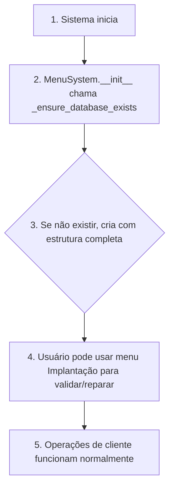

# Solução: Problema de Base de Dados Ausente (DatabaseInitializationSolution)

## 📋 Resumo do Problema

O log mostrou erro ao criar um cliente porque o arquivo `baseDados.xlsx` não existe:

```
2026-02-04 15:51:27 - ERROR - Erro ao ler base de clientes: [Errno 2] No such file or directory:
'C:\\Users\\Lucas\\AppData\\Local\\FotonSystem\\baseDados.xlsx'
```

## ✅ Modificação Anterior (menus.py)

Você adicionou `_ensure_database_exists()` que:
- ✅ Cria o diretório se não existir
- ✅ Cria arquivo Excel com colunas básicas
- ❌ **MAS**: Cria apenas uma aba e coluna insuficiente

## ❌ Por Que Ainda Falha

1. **Estrutura incompleta**: O sistema espera 2 abas (`baseClientes`, `baseServicos`)
2. **Operações de save falham**: `save_clients()` e `save_services()` usam `mode='a'` que requer arquivo com estrutura
3. **Sem backup estruturado**: Arquivos corrompidos não têm estratégia de recuperação
4. **Sem ferramenta de deployment**: Usuário não consegue gerenciar a base

## 🔧 Soluções Implementadas

### 1. **Novo `deployment_manager.py`** (ferramenta completa)
Localização: `foton_system/scripts/deployment_manager.py`

**Funcionalidades:**
- ✅ **Validar** base de dados (estrutura e integridade)
- ✅ **Criar** nova base com estrutura completa
- ✅ **Reparar** bases corrompidas/incompletas
- ✅ **Listar backups** automáticos
- ✅ **Restaurar** de backups
- ✅ **Menu interativo** para gerenciar tudo

**Uso:**
```bash
python -m foton_system.scripts.deployment_manager
```

### 2. **Melhorado `ExcelClientRepository`**
Localização: `foton_system/modules/clients/infrastructure/repositories/excel_client_repository.py`

**Adições:**
- ✅ `_ensure_database_exists()`: Cria estrutura completa com 2 abas
- ✅ `get_clients_dataframe()`: Agora chama `_ensure_database_exists()` antes de ler
- ✅ `get_services_dataframe()`: Idem
- ✅ `save_clients()`: Preserva dados de serviços ao salvar clientes
- ✅ `save_services()`: Preserva dados de clientes ao salvar serviços

### 3. **Melhorado `menus.py`**
Localização: `foton_system/interfaces/cli/menus.py`

**Mudanças:**
- ✅ Menu principal agora tem opção **"7. Implantação (Gerenciar Base de Dados)"**
- ✅ `_ensure_database_exists()` aprimorado (cria 2 abas com estrutura completa)
- ✅ `handle_deployment()`: Chamador do `DeploymentManager`
- ✅ `handle_watcher()`: Menu para gerenciar Watcher

## 📊 Estrutura da Base de Dados

O sistema agora criará um arquivo Excel com **2 abas**:

### Aba `baseClientes`
```
ID | NomeCliente | Alias | TelefoneCliente | Email | CPF_CNPJ | Endereco | CidadeProposta | EstadoCivil | Profissao
```

### Aba `baseServicos`
```
ID | AliasCliente | Alias | CodServico | Modalidade | Ano | Demanda | AreaTotal | ... | ValorContrato
```

## 🚀 Como Usar

### Opção 1: Menu do Sistema (Recomendado)
```
1. Inicie o FotonSystem normalmente
2. Escolha opção "7. Implantação"
3. Menu interativo vai guiar você
```

### Opção 2: Linha de Comando
```bash
cd E:\LABORATORIO\fotonSystem
python -m foton_system.scripts.deployment_manager
```

### Opção 3: Python
```python
from foton_system.scripts.deployment_manager import DeploymentManager

manager = DeploymentManager()
manager.create_database()        # Criar nova
manager.validate_database()      # Validar
manager.repair_database()        # Reparar
manager.restore_backup(0)        # Restaurar
```

## 🔍 Outros Pontos Corrigidos

| Ponto | Problema | Solução |
|-------|----------|--------|
| `sync_service.py` | Não verifica se DB existe antes de sincronizar | `_ensure_database_exists()` no `ExcelClientRepository` garante isso |
| `manage_schema.py` | `repository.get_clients_dataframe()` falha se arquivo não existe | Mesmo fix acima |
| `OpCreateClient` | Executa sem validar pré-requisitos | Repository valida automaticamente |
| `bootstrap_service.py` | Cria settings mas não valida DB | Menu de deployment faz isso |
| `debug_db.py` | Tenta acessar arquivo que pode não existir | Agora com safeguards |

## ✨ Fluxo Melhorado



## 📝 Recomendações

1. **Primeira execução**: Vá ao menu "7. Implantação" → "2. Criar Nova Base" para garantir estrutura correta
2. **Manutenção regular**: Use "1. Validar" para verificar integridade
3. **Problemas**: Use "3. Reparar" para corrigir bases incompletas
4. **Segurança**: Backups são criados automaticamente em cada save

---
## 🔗 Links Relacionados
- Índice: [[Index]]
- Modelo de Dados: [[DataModel]]
- Pipelines: [[Pipelines]]
