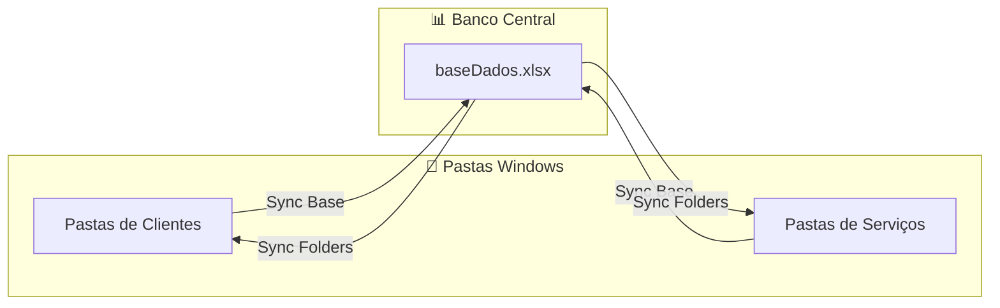

# 🔄 Pipelines do Sistema FOTON

> **Como a mágica acontece por trás das cortinas.**

Este documento explica os fluxos de dados do FOTON de forma visual e simplificada.

> **Quer entender a teoria por trás?** Veja [[Concepts|Conceitos de Arquitetura]]

---

## 1. Sincronização Cliente/Serviço

### Para Humanos 🧠

> **Detalhes técnicos em:** [[DataModel|Modelo de Dados]]

> Você cria uma pasta no Windows → O FOTON atualiza o Excel automaticamente.
> Você cadastra no Excel → O FOTON cria a pasta automaticamente.

### Diagrama Técnico

---

## 2. Centros de Verdade (INFO Files)

### Para Humanos 🧠

> **Veja a estrutura completa:** [[DataModel|Modelo de Dados]]
> **Aprenda a usar:** [[UserGuide]]

> Cada cliente tem um "cartão de visita digital" chamado `INFO-CLIENTE.md`.
> Você pode editar esse arquivo no Bloco de Notas, e o FOTON respeita.
> Quando você altera no Excel, o sistema atualiza o arquivo. E vice-versa.

---

## 3. Geração de Documentos

### Para Humanos 🧠

> **Entenda a lógica:** [[Concepts]]
> **Tutorial prático:** [[UserGuide]]

---

## 4. Ferramentas Administrativas

### 4.1 Gerenciador de Schema
> **Aprenda a usar:** [[UserGuide]]

### 4.2 Diagnóstico do Sistema
> **Entenda quando usar:** [[UserGuide]]

---
## 🔗 Links Relacionados
- Índice: [[Index]]
- Modelo de Dados: [[DataModel]]
- Arquitetura: [[Concepts]]

**Desenvolvido para Arquitetos que querem projetar, não gerenciar arquivos.**

🔗 [LAMP Arquitetura](https://github.com/LAMP-LUCAS/fotonSystem) | 🌍 [Mundo AEC](https://www.mundoaec.com)
