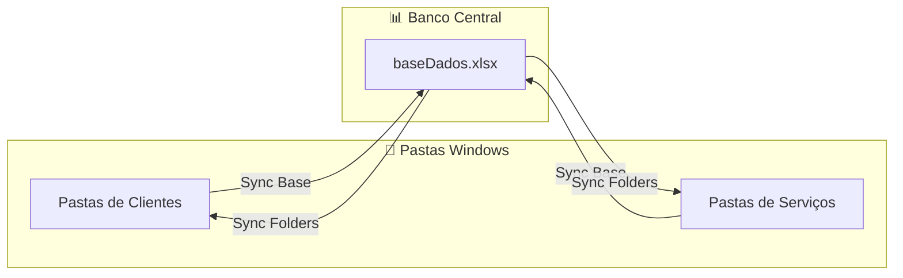
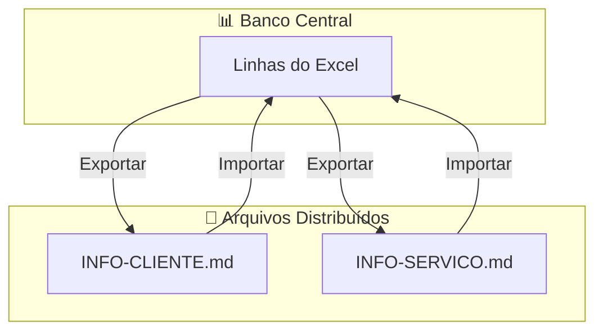
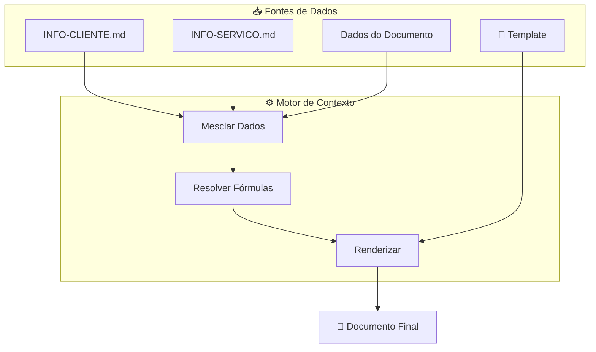
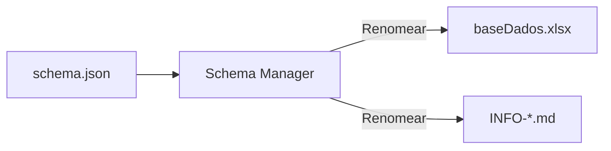
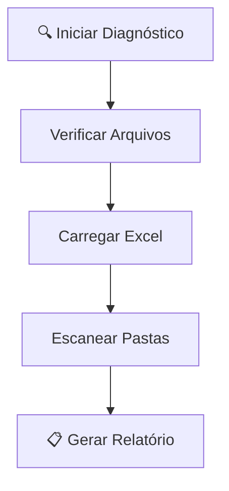

# 🔄 Pipelines do Sistema FOTON

> **Como a mágica acontece por trás das cortinas.**

Este documento explica os fluxos de dados do FOTON de forma visual e simplificada.

> **Quer entender a teoria por trás?** Veja [[Concepts|Conceitos de Arquitetura]]

---

## 1. Sincronização Cliente/Serviço

### Para Humanos 🧠

> **Detalhes técnicos em:** [[DataModel|Modelo de Dados]]

> Você cria uma pasta no Windows → O FOTON atualiza o Excel automaticamente.
> Você cadastra no Excel → O FOTON cria a pasta automaticamente.

### Diagrama Técnico

---

## 2. Centros de Verdade (INFO Files)

### Para Humanos 🧠

> **Veja a estrutura completa:** [[DataModel|Modelo de Dados]]
> **Aprenda a usar:** [[UserGuide]]

> Cada cliente tem um "cartão de visita digital" chamado `INFO-CLIENTE.md`.
> Você pode editar esse arquivo no Bloco de Notas, e o FOTON respeita.
> Quando você altera no Excel, o sistema atualiza o arquivo. E vice-versa.

### Diagrama Técnico

---

## 3. Geração de Documentos

### Para Humanos 🧠

> **Entenda a lógica:** [[Concepts]]
> **Tutorial prático:** [[UserGuide]]

> Quando você pede uma proposta, o FOTON:
>
> 1. Pega os dados do cliente (nome, endereço, CPF)
> 2. Pega os dados do serviço (tipo de projeto, área)
> 3. Junta tudo como um sanduíche 🥪
> 4. Substitui as variáveis no template
> 5. Salva o documento pronto na pasta

### Diagrama Técnico

> [!TIP]
> O dado mais específico sempre vence. Se o cliente tem `@cidade: SP` e o serviço tem `@cidade: RJ`, o documento usará `RJ`.

---

## 4. Ferramentas Administrativas

### 4.1 Gerenciador de Schema

#### Para Humanos 🧠

> **Aprenda a usar:** [[UserGuide]]

> Você quer renomear `@obs` para `@observacoes`?
> O Schema Manager faz isso em TODO o sistema de uma vez: Excel, arquivos INFO, tudo!

### 4.2 Diagnóstico do Sistema

#### Para Humanos 🧠

> **Entenda quando usar:** [[UserGuide]]

> O sistema está estranho? Rode o diagnóstico.
> Ele verifica tudo e gera um relatório em `reports/`.

### 4.3 Correção em Lote

#### Para Humanos 🧠

> **Tutorial:** [[UserGuide]]

> Adicionou um campo novo no template? Use a correção em lote.
> O sistema adiciona esse campo em TODOS os arquivos INFO automaticamente.

---
## 🔗 Links Relacionados
- Índice: [[Index]]
- Modelo de Dados: [[DataModel]]
- Arquitetura: [[Concepts]]

**Desenvolvido para Arquitetos que querem projetar, não gerenciar arquivos.**

🔗 [LAMP Arquitetura](https://github.com/LAMP-LUCAS/fotonSystem) | 🌍 [Mundo AEC](https://www.mundoaec.com)
