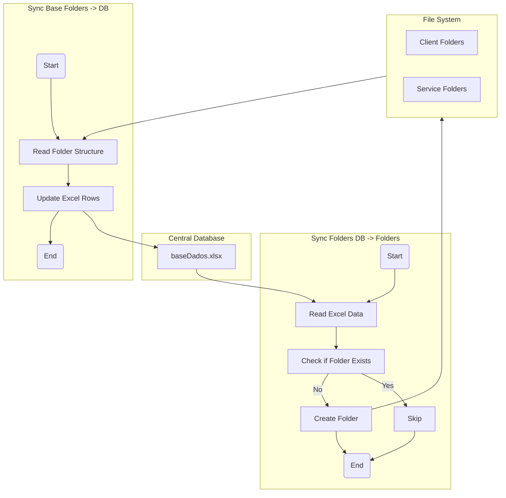
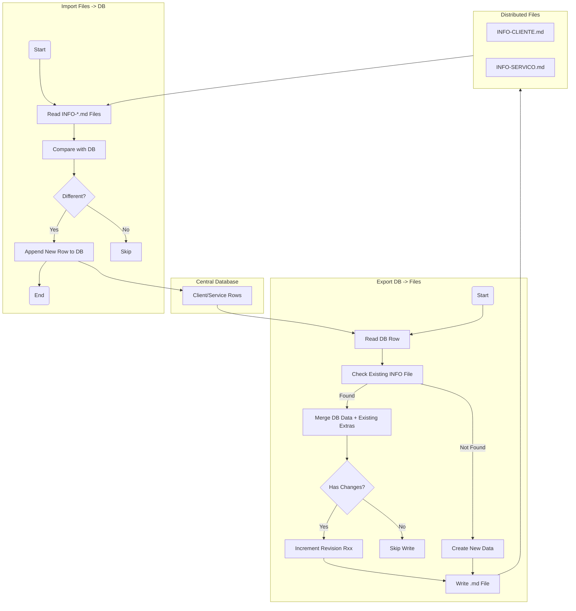
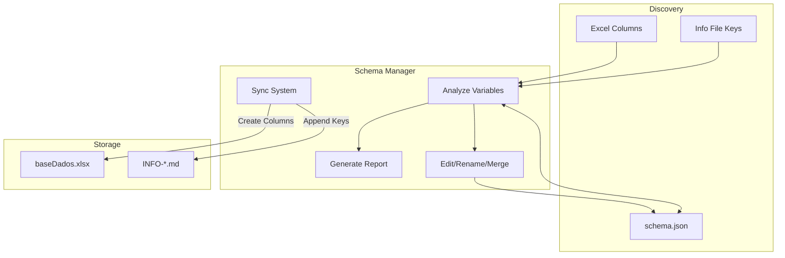
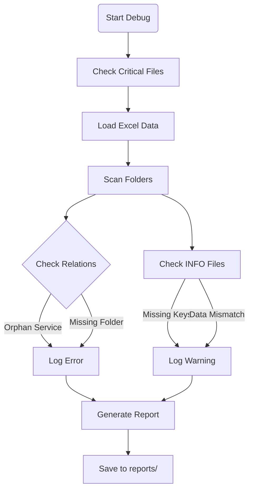
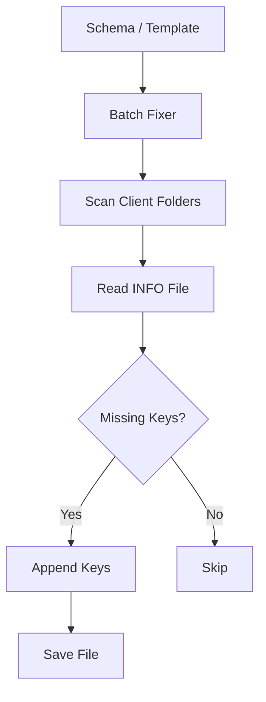

# System Pipelines

This document visualizes the core workflows and data pipelines of the FOTON System using flowcharts.

## 1. Client & Service Synchronization

This pipeline ensures consistency between the Central Database (`baseDados.xlsx`) and the File System (Folders).

## 2. Distributed Database (Centers of Truth)

This pipeline manages the bi-directional synchronization between the Central Database and the Distributed "Truth Files" (`INFO-*.md`) located in client/service folders.

## 3. Document Generation (Context-Aware)

This pipeline generates documents (Proposals, Contracts) by aggregating data from multiple levels of the hierarchy ("Centers of Truth").

```mermaid
flowchart TD
    subgraph Inputs [Data Sources]
        L1[INFO-CLIENTE.md]
        L2[INFO-SERVICO.md]
        L3[Document Data .md]
        TPL[Template .docx/.pptx]
    end

    subgraph Engine [Context-Aware Engine]
        Load[Load & Parse Files]
        
        subgraph Merging [Context Merging Strategy]
            direction TB
            P1[Base: Client Data]
            P2[Override: Service Data]
            P3[Override: Document Data]
            P1 --> P2 --> P3
        end
        
        Math[Math Resolver]
        Val[Validate vs Template]
        Render[Render Document]
    end

    subgraph Outputs
        File[Final Document]
        Log[Audit Log]
    end

    L1 --> Load
    L2 --> Load
    L3 --> Load
    TPL --> Val
    TPL --> Render

    Load --> P1
    P3 --> Math
    Math --> |Resolved Context| Val
    Val --> |Validated Context| Render
    
    Render --> File
    Render --> Log

    style Merging fill:#155,stroke:#333,stroke-width:2px
    style Math fill:#002,stroke:#333,stroke-width:2px
```

## 4. Administrative Tools Pipelines

These pipelines support system maintenance, data integrity, and schema evolution.

### 4.1. Schema Management (Variable Evolution)

This pipeline handles the discovery, definition, and synchronization of system variables.

### 4.2. System Diagnosis (Health Check)

This pipeline performs a deep scan of the system to identify inconsistencies.

### 4.3. Batch Correction (Fixer)

This pipeline automates the repair of distributed data files based on the defined schema.

---

**Desenvolvido para Arquitetos que querem projetar, não gerenciar arquivos.** Veja mais em [Mundo AEC](https://www.mundoaec.com)
