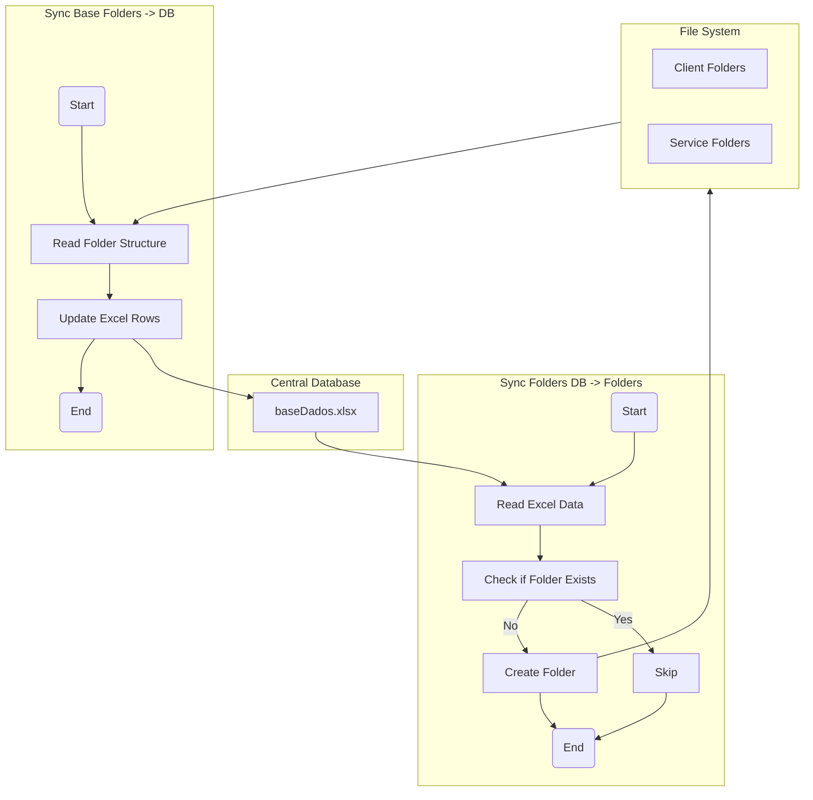
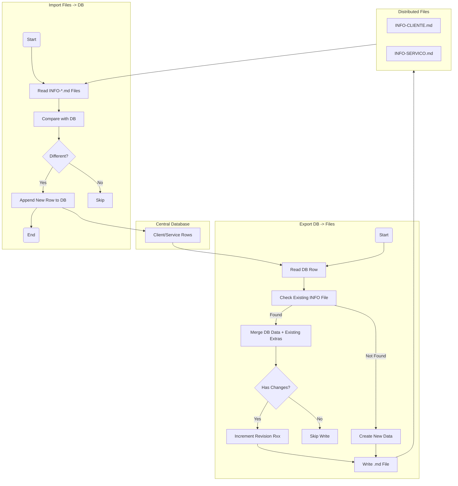
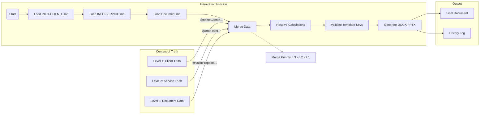

# System Pipelines

This document visualizes the core workflows and data pipelines of the LAMP system using flowcharts.

## 1. Client & Service Synchronization

This pipeline ensures consistency between the Central Database (`baseDados.xlsx`) and the File System (Folders).

## 2. Distributed Database (Centers of Truth)

This pipeline manages the bi-directional synchronization between the Central Database and the Distributed "Truth Files" (`INFO-*.md`) located in client/service folders.

## 3. Document Generation (Context-Aware)

This pipeline generates documents (Proposals, Contracts) by aggregating data from multiple levels of the hierarchy ("Centers of Truth").

