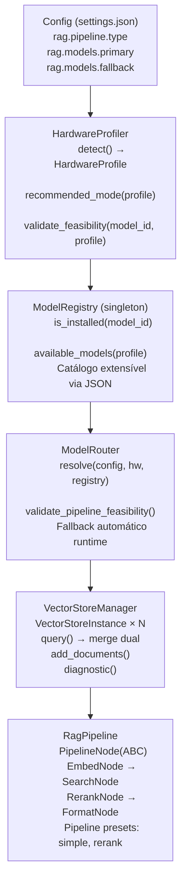

# Guia do Desenvolvedor — RAG Multi-Modelo

> **Referência:** SPEC-RAG-v2.0 (`specs/MOD-RAG/SPEC-RAG-v2.0.md`)
> **Épico:** EPIC-004 — RAG Pipeline Inteligente

---

## 1. Arquitetura — 6 Camadas

O RAG v2.0 é organizado em 6 camadas independentes:



### Responsabilidades

| Camada | Arquivo | Propósito |
|--------|---------|-----------|
| Hardware Profiler | `core/rag/hardware_profiler.py` | Detecta CPU, RAM, GPU, disco | `RULE-RAG-7.1` a `7.4` |
| Model Registry | `core/rag/model_registry.py` | Catálogo de modelos conhecidos | `RULE-RAG-8.1` a `8.4` |
| Model Router | `core/rag/model_router.py` | Resolve modelos ativos + fallback | `RULE-RAG-9.1` a `9.5` |
| Vector Store Manager | `core/memory/vector_store.py` | Gerencia coleções ChromaDB | `RULE-RAG-10.1` a `10.7` |
| Pipeline Nodes | `core/rag/nodes/*.py` | Nós de inferência (embed, search, rerank, format) | `RULE-RAG-11.1` a `11.6` |
| Download Manager | `core/rag/download_manager.py` | Download com progress callback | `RULE-RAG-12.1` a `12.5` |

---

## 2. Adicionando um Novo Modelo ao Registry

### Via settings.json (sem código)

Adicione na seção `rag.models.extra`:

```json
{
  "rag": {
    "models": {
      "primary": "minilm",
      "fallback": ["minilm"],
      "extra": [
        {
          "id": "jinaai",
          "name": "jinaai/jina-embeddings-v2-base-pt",
          "type": "embedding",
          "dimensions": 768,
          "ram_required_gb": 2.0,
          "disk_required_gb": 0.8,
          "requires_gpu": false,
          "is_default": false
        }
      ]
    }
  }
}
```

O `ModelRegistry` carrega automaticamente modelos da seção `extra` na inicialização (`RULE-RAG-8.4`). Não é necessário alterar código Python.

### Via código (modelo built-in)

Adicione um `ModelEntry` em `model_registry.py`:

```python
ModelEntry(
    id="jinaai",
    name="jinaai/jina-embeddings-v2-base-pt",
    type="embedding",
    dimensions=768,
    ram_required_gb=2.0,
    disk_required_gb=0.8,
    requires_gpu=False,
    is_default=False,
)
```

---

## 3. Criando um Nó de Pipeline Customizado

Implemente a interface `PipelineNode` (`RULE-RAG-11.1`):

```python
# core/rag/nodes/my_custom_node.py
from core.rag.pipeline import PipelineNode, ProcessContext

class MyCustomNode(PipelineNode):
    name = "my_custom"
    input_keys = ["query", "embeddings"]
    output_keys = ["enriched_query"]

    async def execute(self, context: ProcessContext) -> ProcessContext:
        query = context["query"]
        # Sua lógica aqui
        context["enriched_query"] = query + " [enriquecido]"
        return context
```

### Registrando o Nó no Pipeline

Abra `core/rag/pipeline.py` e adicione ao `_NODE_REGISTRY`:

```python
from core.rag.nodes.my_custom_node import MyCustomNode

_NODE_REGISTRY = {
    "embed": EmbedNode,
    "search": SearchNode,
    "rerank": RerankNode,
    "format": FormatNode,
    "my_custom": MyCustomNode,  # <-- adicionado
}
```

### Configurando o Pipeline no settings.json

```json
{
  "rag": {
    "pipeline": {
      "type": "custom",
      "nodes": ["embed", "my_custom", "search", "format"]
    }
  }
}
```

> 💡 O `ProcessContext` é um dict progressivo. Cada nó recebe o contexto enriquecido pelos nós anteriores. Chaves válidas: `query`, `embeddings`, `raw_results`, `scored_results`, `formatted_output`, `n_results`, `where`.

---

## 4. Rodando os Benchmarks

```bash
python -m pytest benchmarks/rag_benchmark.py -v --benchmark
```

A flag `--benchmark` é obrigatória. Sem ela, todos os benchmarks são SKIPPED.

### Cenários testados

| Cenário | SLA | O que valida |
|---------|-----|-------------|
| MiniLM simple query | < 3600 ms p95 | Performance básica do modelo padrão |
| BGE-M3 simple (CPU) | < 6000 ms p95 | Performance do modelo pesado |
| Dual mode overhead | < 2.4× | Sobrecarga do modo dual vs single |
| Index 100 chunks | < 36000 ms | Velocidade de indexação |
| HardwareProfiler.detect() | < 120 ms | Overhead do profiler |
| Pipeline sequential | embed→search→format | Ordem de execução dos nós |

### Relatório

A execução gera `.opencode/metrics/benchmark_report.json` com métricas p50/p95/p99.

---

## 5. Rodando os Testes de Integração

```bash
python -m pytest tests/integration/test_rag_pipeline_e2e.py -v
```

Testa o pipeline completo: embedding → busca ChromaDB → formatação, usando fixtures mockadas para SentenceTransformer e ChromaDB real.

### Suite completa (452 testes, zero regressão)

```bash
python -m pytest
```

---

## 6. Migração da v1.0

Se você está atualizando de uma instalação anterior:

```bash
python -m pytest tests/test_rag_migration.py -v
```

A migração (`core/rag/migration.py`) renomeia a coleção legada `foton_knowledge_base` para `foton_minilm_384d` e adiciona metadata de modelo (STORY-035).

---

## 7. Debug e Logs

- Logs do RAG: `%LOCALAPPDATA%\FotonSystem\foton_mcp.log` (rotação 5 MB, 3 backups)
- Cache de modelos: `~/.cache/huggingface/` (ou `HF_HOME`)
- Status do Circuit Breaker: visível no diagnóstico (menu RAG → Opção 1)
